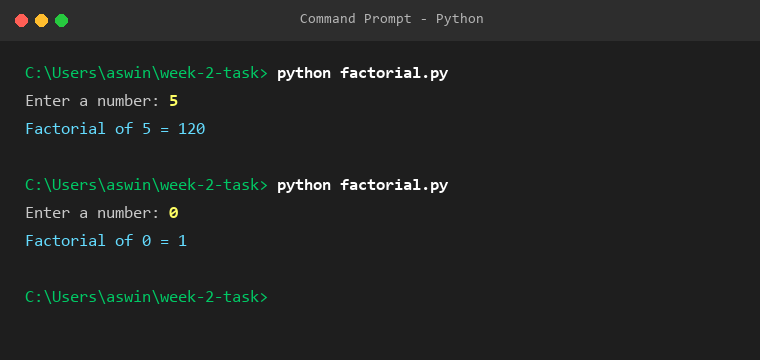

# Week 2 — Factorial of a Given Number

**Student Name:** ASWIN D  
**Register No:** 111924CB01301  
**Department:** B.E. Computer Science and Engineering (Cybersecurity)  

---

## Problem Statement
Write a Python program to find the factorial of a given number.

## Input Format
```text
Enter a number: 5
```

## Output Format
```text
Factorial of 5 = 120
```

## Program Output Screenshot


## How to Run
```bash
python factorial.py
```
